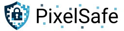

 

PixelSafe is a steganography tool for PNG images that uses the Least Significant Bit (LSB) algorithm.

It lets you embed hidden data inside PNG files - for example, storing a KeePass database inside a screenshot.
You can use it to hide backup files, send private messages, embed digital signatures, or attach invisible metadata to your images.

## Acknowledgements

* JetBrains for making [Kotlin](https://kotlinlang.org).
* Mike Hearn for making [Hydraulic Conveyor](https://conveyor.hydraulic.dev).
* Yahor for making the [Valkyrie IDEA plugin](https://github.com/ComposeGears/Valkyrie).

## Contributions

Contributions to this project are welcome! If you encounter any issues,
have suggestions for improvements, or would like to contribute new features,
please feel free to submit a pull request.

## Licenses

PixelSafe is licensed under the GNU Affero General Public License (AGPL),
ensuring the community's freedom to use, modify, and distribute the software.

Icons are sourced from Google Material Design.

The PixelSafe logo is a copyrighted, professionally commissioned design.
Please do not reuse it in forks; create your own instead.
